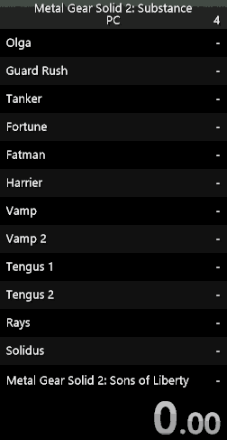
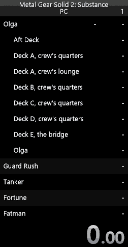
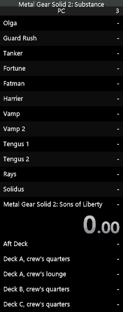

# Guide to LiveSplit layout settings

| Major splits only | Contextual subsplits | Separate subsplits |
|:-----------------:|:--------------------:|:------------------:|
|  |  |  |

## Standard
This is a simple splits style that shows every area in order.

Downside: You quickly lose sight of the earlier parts of a run.
* Use a **regular split file** (without "subsplits" in the filename) and the **Splits component**
* Set up the layout as normal

## Major splits only
This style is a more compact one similar to how non-autosplitter runs look.

Downside: It's only hiding the other splits, so it can be difficult to fix if they get out of sync with the run.
* Use a **subsplits split file** and the **Subsplits component**
* Select **Always Hide Subsplits**
* Disable **Show Section Header**
* Set **Total Splits** and **Upcoming Splits** as desired

## Contextual subsplits
This style gradually builds up your major splits as the run goes on, while showing the subsplits in your current section.

Downside: The last subsplit in a section disappears immediately when you complete it - you can use a **Previous Section component** instead to see the split time if necessary.
* Use a **subsplits split file** and the **Subsplits component**
* Set **Total Splits** and **Minimum Number Of Sections Before Current Section** to the number of *sections* in the split (13 by default for Tanker-Plant)
* Set **Upcoming Splits** to 1. You could choose a higher number, but also increase Total Splits by the same amount.
* Disable **Always Show Last Split**. If you leave it enabled, also increase Total Splits by 1.

## Separate sections and subsplits
This style shows all your major splits at all times, as well as your most recent subsplits. It gives the best overall view on a run that already has split times from a previous run.

Downside: Uses a lot of space. Sections with few splits (particularly during the endgame) will leave an empty space in the layout. More difficult to set up.
* Use a **subsplits split file** and **two Subsplits components**
* In one Subsplits component:
  * Set **Total Splits** to the number of *sections* in the split (13 by default for Tanker-Plant)
  * Select **Always Hide Subsplits**
  * Disable **Show Section Header**
* In the other Subsplits component:
  * Disable **Always Show Last Split**
  * Set **Total Splits** and **Upcoming Splits** as desired
  * *Either* select **Always Show Subsplits**, *or* select **Contextual Subsplits** and enable **Only Current Section**
  * *Optionally*, disable **Show Section Header** and **Indent Subsplits**
