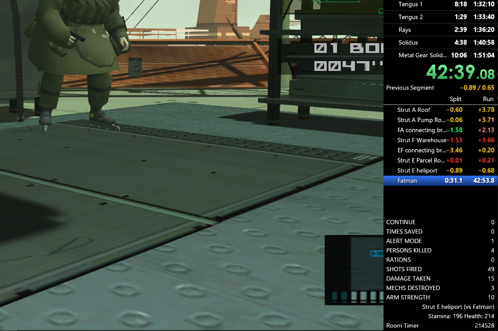

⚠️ _If you were previously using the variable_ ___ASL_BestCodeName___ _be aware that it is now called_ ___ASL_CodeNameStatus___.

# livesplit_asl_mgs2
A LiveSplit autosplitter for Metal Gear Solid 2 Substance on PC

This autosplitter is early in development, and may not be well-tested (or even working).

Bug reports are welcomed so they can be stamped out, as is discussion of locations you would like to be able to split (or not split) that are not currently made available.

# Right now...
* Instant split mode does not respect your settings for boss areas, so if enabled it will always split for all bosses (except Guard Rush)
* In Boss Survival, instant split mode does not function for Olga, Guard Rush and Tengus (those splits will appear when the next battle begins), and in regular split mode there is no split after Solidus. It's recommended to use instant split mode.
* The ARMSTREN ASL Var Viewer variable only works for Raiden
* The Best Codename ASLVV variable incorrectly shows the rank Doberman instead of "Perfect Stats" in Snake Tales

# Features
* Automatic splitting for Tanker, Plant, Snake Tales, Boss Survival, and VR Missions (per-category)
* Instant splitting when you defeat a boss or collect a dog tag
* [ASL Var Viewer](https://github.com/hawkerm/LiveSplit.ASLVarViewer) support for room names, game stats, live information including boss health, and your current Big Boss/Perfect Stats status
* Alternate "Strategy Testing" mode allowing you to compare strategies more easily when testing

# Notes
* The LSL files included here will work with the default split location settings. See the mouseover tooltips on each split-related setting in Advanced Options for advice on what to add or remove from your splits.
  * If you want to only show major splits, or categorise splits, in your LiveSplit layout: open a "subsplits" LSL file, and use a Subsplits component and select "Always Hide Subsplits".
  * You can freely rename splits, or change which splits are section headers and which are subsplits (by adding/removing the hyphen symbol from the name).
  * The "Easy-Normal" files exit Aft Deck to Deck-B, and go clockwise (starting at Strut D) for the early bomb hunt. The "Very Easy" file also goes directly from Strut E to Shell 1 Core.
  * The "Hard-EuEx" files exit Aft Deck to Deck-A, and go anticlockwise (starting at Strut B) for the early bomb hunt.
* There are two modes for boss splits. If you would like to use the simpler mode that splits on fadeout, disable the autosplitter setting for it.
* The in-game timer for Boss Survival is not the same as the timer shown on screen - the IGT adds a little time at the start of each battle, continues during cutscenes, and continues while you have a menu open.
* VR Missions splitting is done per-category, when you exit back to the missions menu. Visiting a mission (not beating it!) is usually sufficient to log it, so it's possible to trigger accidentally if you give up on a mission and exit out.
  * Raiden (Ninja), Pliskin, Tuxedo Snake and Snake (MGS1) have Variety categories that are entirely contained within the larger Variety mission set the other characters have. To avoid accidentally triggering the smaller categories, they're disabled in settings.
    * If you're doing a character run with one of those characters, you'll need to enable them in the settings.
    * If doing an all-characters run, enable them all, but make sure to start every character's Variety category at Variety 1 and choose Next Stage at each results screen. This is not necessary in any other category.
* Strategy Testing can be enabled and customised in the settings.
  * You can disable the regular autosplitter behaviour, and enable splits on every area code change, every screen load (e.g. after a continue), or when pressing the START (pausing/unpausing) and/or R3 (on-the-fly) buttons.
  * This mode works best with a large throwaway set of unnamed splits (see *Split Files/MGS2 - Strategy Testing.asl*), on a layout that displays the time between splits, and does not show deltas.

# ASL Var Viewer
The following variables are available in the Variables category:

Analysis:
* **ASL_CodeNameStatus** Shows the best possible codename, and, if you've already missed the top rank, the reason(s) for that. This can be used to keep track of Perfect Stats/Big Boss runs, or your major stats in general.
* **ASL_Info** Shows info relevant to your current situation, including boss health values and grip/O2/chaff/caution info. Which info is shown can be customised in settings. Can also be set to show your location (as *ASL_CurrentRoom*) when no contextual info is available.

Other stats:
* **ASL_Alerts** Number of Alerts
* **ASL_ClearingEscapes** Number of Clearing Escapes
* **ASL_CodeName** The best possible Codename from the current game state
* **ASL_Continues** Number of Continues
* **ASL_CurrentRoom** The current game location
* **ASL_CurrentRoomCode** The game's internal code for the current location
* **ASL_DamageTaken** Amount of Damage taken [More info](https://metalgearspeedrunners.com/wiki/doku.php?id=mgs2_difficulty_differences#health_values)
* **ASL_DogTags**, **ASL_DogTags_Snake**, **ASL_DogTags_Raiden** Number of dog tags collected (overall, or for each character)
* **ASL_Difficulty** The name of the current difficulty, from Very Easy to European Extreme
* **ASL_MechsDestroyed** Number of mechs (Cyphers, etc.) destroyed. This was previously thought to contribute to your codename, but is not actually relevant.
* **ASL_Kills** Number of people Killed
* **ASL_LastDamage** Amount of Damage taken from the most recent damage event
* **ASL_Level** Whether you're in Tanker, Plant or Tanker-Plant (main game only)
* **ASL_Rations** Number of Rations used
* **ASL_RoomTimer** The number of frames (60/sec) spent in the current room. This can be used to aid in strategy finding.
* **ASL_Saves** Number of Saves
* **ASL_Shots** Number of Shots fired
* **ASL_Strength** Your current character's Arm Strength. Grip Up occurs at 100 and 200.
